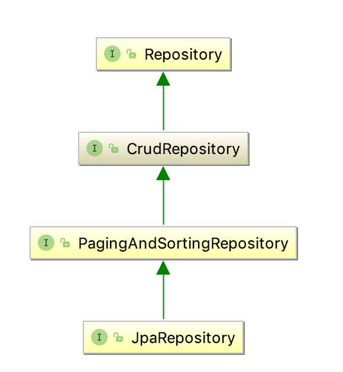

# 核心概念

spring 数据仓库中最核心的抽象接口为Repository，它以一个领域对象，以及这个领域对象的id的类型为输入参数。 CrudRepository为对象提供了一些更为复杂的管理函数。相关类的继承关系如下。




* CrudRepository  

```java
public interface CrudRepository<T, ID extends Serializable>
  extends Repository<T, ID> {

  <S extends T> S save(S entity);  //保存实体类，如果id不为空则是更新，否则是插入

  Optional<T> findById(ID primaryKey); //通过主键查找

  Iterable<T> findAll();               //查找所有 

  long count();          //计数              

  void delete(T entity);          //删除     

  boolean existsById(ID primaryKey);   //判断是否存在

  // … more functionality omitted.
}

```


* ``PagingAndSortingRepository``抽象类继承了``CrudRepository``类，并且提供了额外的一些按页查询的方法；

```java
public interface PagingAndSortingRepository<T, ID extends Serializable>
  extends CrudRepository<T, ID> {

  Iterable<T> findAll(Sort sort);

  Page<T> findAll(Pageable pageable);
}
```

```java
//查询第二页的20个用户
PagingAndSortingRepository<User, Long> repository = // … get access to a bean
Page<User> users = repository.findAll(PageRequest.of(1, 20));
```


* 对于查询和删除来说都可以使用查询推断；

```java
interface UserRepository extends CrudRepository<User, Long> {

  long countByLastname(String lastname);

  long deleteByLastname(String lastname);
  List<User> removeByLastname(String lastname);
}
```