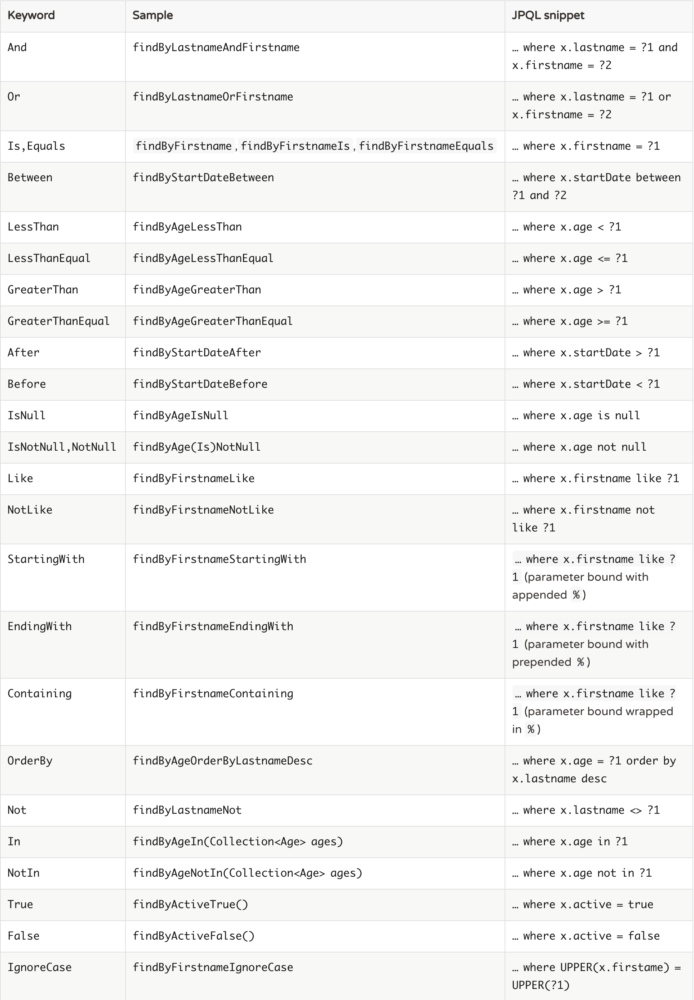

# 查询条件

## jpa查询方法

```java
public interface UserRepository extends Repository<User, Long> {
  List<User> findByEmailAddressAndLastname(String emailAddress, String lastname);
}
```

* 支持关键字   





## 使用@Query关键字 

可以在仓库接口的方法上加上该注解，实现数据库的查询。

```java
public interface UserRepository extends JpaRepository<User, Long> {

  @Query("select u from User u where u.emailAddress = ?1")
  User findByEmailAddress(String emailAddress);

   @Query("select u from User u where u.firstname like %?1")
  List<User> findByFirstnameEndsWith(String firstname);
}
```

* 该注解也允许我们执行原生的数据库查询 ，设置字段``nativeQuery = true``即可。

```java
public interface UserRepository extends JpaRepository<User, Long> {

  @Query(value = "SELECT * FROM USERS WHERE EMAIL_ADDRESS = ?1", nativeQuery = true)
  User findByEmailAddress(String emailAddress);


  @Query(value = "SELECT * FROM USERS WHERE LASTNAME = ?1",
    countQuery = "SELECT count(*) FROM USERS WHERE LASTNAME = ?1",
    nativeQuery = true)
  Page<User> findByLastname(String lastname, Pageable pageable);
}

```


## 使用样例查询

* 简单使用

```java
  Optional<User>  u1 = userRepository.findOne(Example.of(user));
  List<User> users1 = userRepository.findAll(Example.of(user));
```


* 自定义条件

```java

@Slf4j
@Service
public class TestService {

    @Autowired
    UserRepository userRepository;

   public void matcher(){
        User user = new User();
        user.setName("nic");
       user.setEmail("www");
        List<User> users =  findPeople(user);
        log.info("users={}",users.toString());
    }

    List<User> findPeople(User probe) {
        ExampleMatcher matcher = ExampleMatcher.matching()
                .withMatcher("name", ExampleMatcher.GenericPropertyMatchers.ignoreCase())
                .withMatcher("email",ExampleMatcher.GenericPropertyMatchers.contains());
        return userRepository.findAll(Example.of(probe,matcher));
    }
}

```